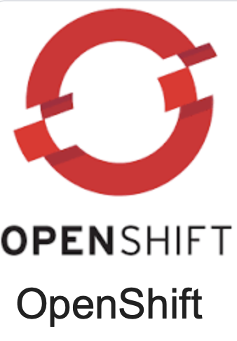
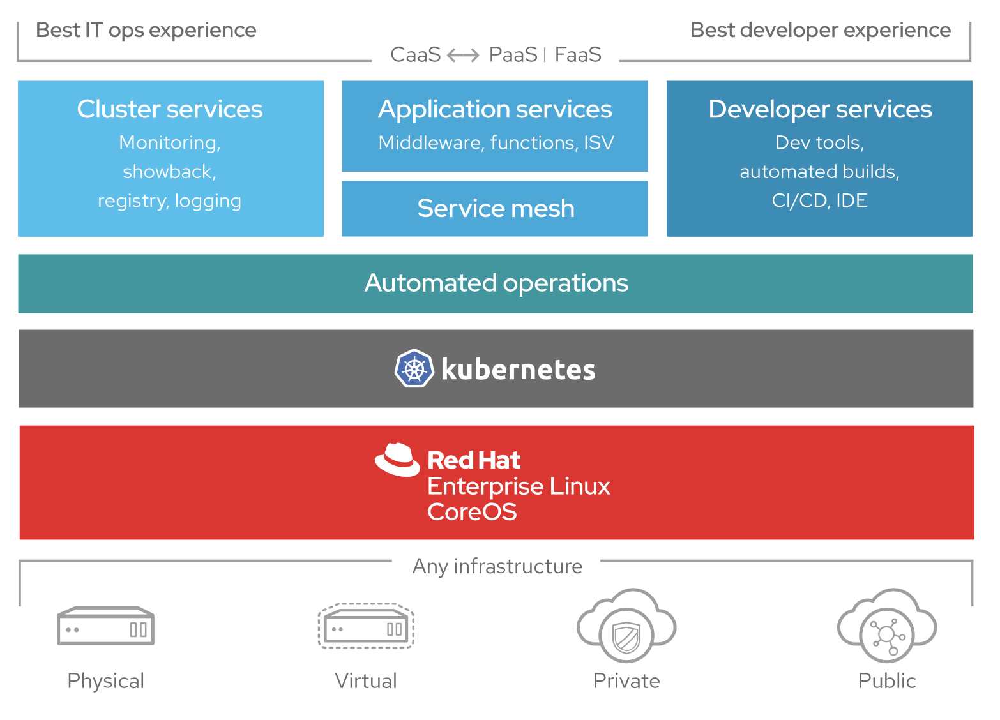
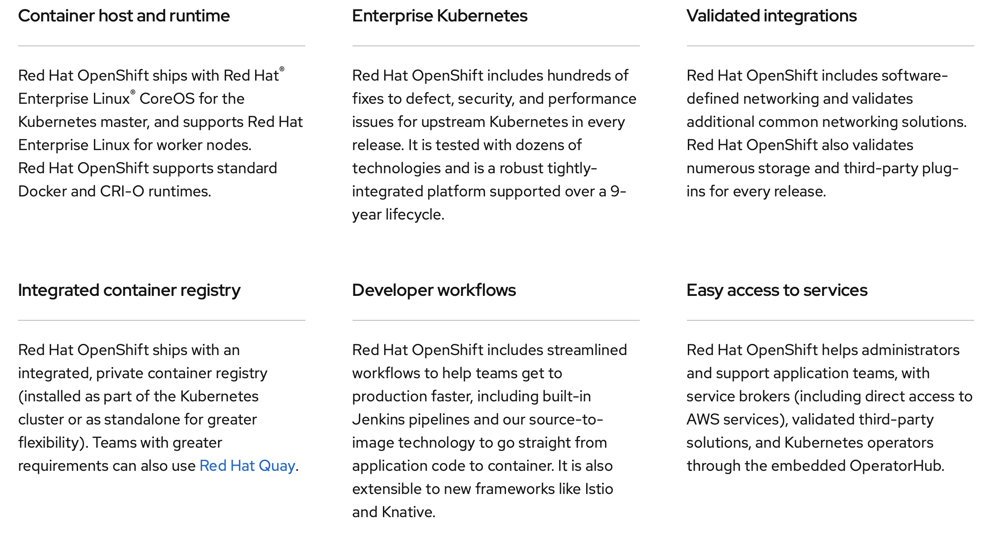

# Introductory material

[IBM Cloud Kubernetes Service](https://www.ibm.com/cloud/container-service)

[Containers and Docker](https://www.ibm.com/cloud/garage/content/course/containers-and-docker/2)

[Introduction to Containers](https://www.ibm.com/cloud/learn/containers)

[Introduction to Minishift](https://github.com/IBMDeveloperUK/minishift101)

[Understanding OpenShift](https://github.com/nheidloff/openshift-on-ibm-cloud-workshops/blob/master/1-understanding-openshift/README.md#understanding-openshift)

# Red Hat Openshift

[Red Hat OpenShift on IBM Cloud](https://cloud.ibm.com/docs/openshift?topic=openshift-why_openshift) is an extension of the IBM Cloud Kubernetes Service, where IBM manages the OpenShift Container Platform for you.

This repository holds a series of workshops that help you as a developer to become familiar with Red Hat OpenShift, how it can be deployed on the IBM Cloud, and how to deploy applications on and with OpenShift.

In order to run these workshops, you need an IBM Cloud account.

### [Workshop 1: Understanding Openshift](https://github.com/IBM/openshift-on-ibm-cloud-workshops#workshop-1-understanding-openshift)

### [Workshop 2: Deploying Java Microservices to OpenShift on IBM Cloud](https://github.com/IBM/openshift-on-ibm-cloud-workshops#workshop-2-deploying-java-microservices-to-openshift-on-ibm-cloud)

### [Resources and Next Steps](https://github.com/nheidloff/openshift-on-ibm-cloud-workshops#resources-and-next-steps)

# [What is Openshift](https://www.openshift.com/learn/what-is-openshift)?

Red Hat OpenShift is a leading hybrid cloud, enterprise Kubernetes application platform, trusted by 1000+ organizations. 

CAAS:Containers as a service
PAAS:Platform as a service
FAAS: Functions as a service

Minishift lifecycle
https://docs.okd.io/latest/minishift/using/basic-usage.html#diagram-minishift-architecture

[Launch Minishift](https://computingforgeeks.com/how-to-run-local-openshift-cluster-with-minishift/)

# Intro https://www.redhat.com/sysadmin/learn-openshift-minishift

OKD is the Origin Community Distribution of Kubernetes that powers Red Hat Open Shift

Minishift is a tool that helps you run OKD locally by launching a single-node OKD cluster inside a virtual machine. With Minishift you can try out OKD or develop with it, day-to-day, on your local machine.

You can run Minishift on the Windows, macOS, and GNU/Linux operating systems. Minishift uses libmachine for provisioning virtual machines, and OKD for running the cluster.

Minishift is a tool that helps you run OKD locally by launching a single-node OKD cluster inside a virtual machine. With Minishift you can try out OKD or develop with it, day-to-day, on your local machine.

You can run Minishift on the Windows, macOS, and GNU/Linux operating systems. Minishift uses libmachine for provisioning virtual machines, and OKD for running the cluster.

Minishift was created by the OKD community project, which was formed to separate the product that relies upon Red Hat's infrastructure from the technology available to everyone. This community is the upstream origin of OpenShift and their Minishift tool allows you to run a containerized single-node cluster so you can develop for Kubernetes on your local machine.

Minishift and OpenShift 4 are very different, but Minishift is nevertheless a powerful introduction to the concept of running a cluster, creating projects, monitoring tasks, and maintaining a cloud infrastructure.
 
# Getting started with minishift.  
## https://docs.okd.io/latest/minishift/getting-started/index.html
## Preparing to install Minishift
### https://docs.okd.io/latest/minishift/getting-started/preparing-to-install.html
## Setting up your virtualization environment
### https://docs.okd.io/latest/minishift/getting-started/setting-up-virtualization-environment.html
### Download Minishift software for your operating system from the Minishift Releases page
### https://github.com/minishift/minishift/releases
### https://docs.okd.io/latest/minishift/getting-started/installing.html
## Install Minishift with Homebrew

## Minishift Quickstart 
### https://docs.okd.io/latest/minishift/getting-started/quickstart.html

## Starting Minishift
### https://docs.okd.io/latest/minishift/getting-started/quickstart.html#starting-minishift

## Deploying a sample application

Create a Node.js example app:

$ oc new-app https://github.com/sclorg/nodejs-ex -l name=myapp
Track the build log until the app is built and deployed:

$ oc logs -f bc/nodejs-ex
Expose a route to the service:

$ oc expose svc/nodejs-ex
Access the application:

$ minishift openshift service nodejs-ex --in-browser
To stop Minishift, use the following command:

$ minishift stop
Stopping local OpenShift cluster...
Stopping "minishift"...

# Using Minishift https://docs.okd.io/latest/minishift/using/index.html

# Tips

eval $(minishift oc-env)

# https://github.com/IBMDeveloperUK/minishift101 Minishft 101 
